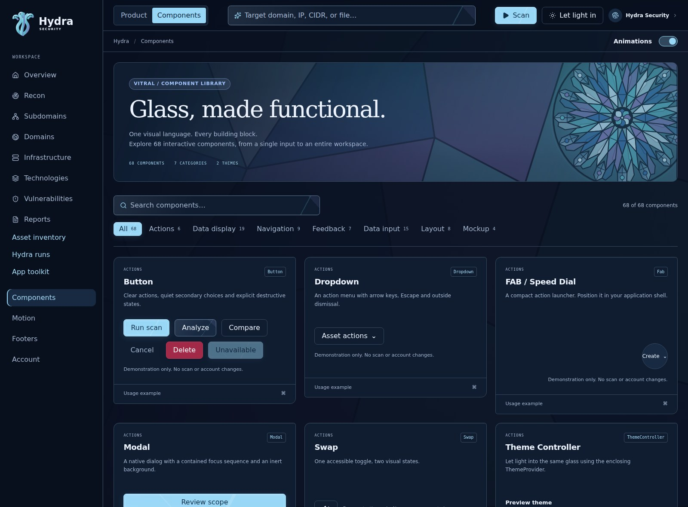
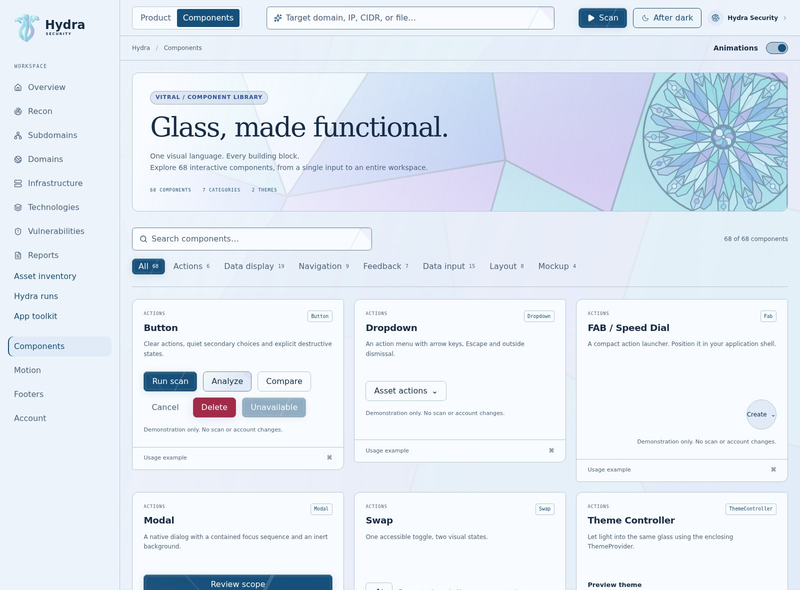

# Vitral component catalog

Hydra covers all **68 component families** listed at <https://daisyui.com/components/>
on **2026-09-30**. Implementations use React, native HTML and Hydra's semantic tokens.
No daisyUI source was copied and no daisyUI dependency or global class system is added.
This is family coverage, not drop-in daisyUI API compatibility or every variation in
its documentation. The existing Hydra API remains available.

## Explore

| Nocturne | Daylight |
| --- | --- |
|  |  |

[Input controls](previews/catalog-inputs.jpg) · [Mobile calendar](previews/catalog-mobile.jpg)

Run `npm run dev`, open **Components**, and use the category filters or search.
`/#components` shows every family. `/#components/otp`, `/#components/calendar`,
and equivalent slugs open a focused preview with a usage excerpt. Browser Back and
Forward work with these routes. **Hydra extensions** preserves the original icon,
document and native input examples below the catalog.

## Install and compose

The package exports ESM, CommonJS, TypeScript declarations and compiled CSS.
It supports the same React peer range as the existing package. Import CSS once.
Use a client component when integrating interactive controls into Next.js.

```tsx
'use client';

import { useState } from 'react';
import {
  Button, Calendar, Modal, MotionProvider, OtpInput,
  ThemeController, ThemeProvider,
} from '@hydra-security/ui';
import '@hydra-security/ui/styles.css';

export function ReviewSettings() {
  const [open, setOpen] = useState(false);
  const [date, setDate] = useState('2026-09-30');
  return (
    <MotionProvider>
      <ThemeProvider storageKey="example:theme">
        <ThemeController />
        <Button onClick={() => setOpen(true)}>Schedule review</Button>
        <Modal open={open} onOpenChange={setOpen} title="Schedule review">
          <Calendar value={date} onValueChange={setDate} label="Review date" />
          <OtpInput label="Verification code" length={6} name="code" />
        </Modal>
      </ThemeProvider>
    </MotionProvider>
  );
}
```

The showcase snippets are usage excerpts: application callbacks, routes and data
come from the consumer. Previews do not send credentials, run scans or upload files.

## Interaction contracts

- **Modal / Drawer:** controlled `open` + `onOpenChange`; native top layer and inert
  background, Escape dismissal, explicit close button, Tab/Shift+Tab cycling and
  native trigger focus restoration. The dialog remains inside its theme boundary.
  Consumers must provide a meaningful `title` and their own submit/cancel actions.
- **Dropdown / Fab:** action records have stable `id`, `label`, `onSelect` and optional
  `disabled`/`danger`. Arrow keys wrap enabled actions; Home/End select the endpoints.
  Escape, selection, outside pointer input and focus departure close the menu.
  Fab renders a speed dial anchored to its trigger; the application chooses where
  to position it. Dock similarly leaves fixed/sticky placement to its layout.
- **Tabs:** `items` contain stable IDs, labels, content and optional disabled states.
  ArrowLeft/ArrowRight and Home/End move and activate tabs. `value`/`onValueChange`
  support controlled use; `defaultValue` supports an internal value.
- **Calendar:** a single Gregorian date encoded as `YYYY-MM-DD`, optional `min`,
  `max`, `locale`, `name` and `disabled`. Date math uses UTC internally to avoid DST
  drift; this is a date, not an instant or time-zone conversion. Labels use Intl.
  Arrow keys move by day/week, Home/End by week boundary, PageUp/Down by month and
  Shift+PageUp/Down by year. Month lengths and leap years are respected. Provide
  valid ISO dates and `min <= max`. Range/multiple selection is not implemented.
- **OTP:** one native text input with numeric input mode, a length constraint,
  pattern validation and `autocomplete="one-time-code"`. Browser paste, cursor
  editing, form submission and autofill remain intact. Verification is the
  application's responsibility. Place it in a form to enforce `required`/pattern.
- **Validator:** native form constraints gate `onValidSubmit(FormData)`. No request
  is made automatically. Server-side validation is still required by the app.
- **Rating / Radio / Filter:** native radio semantics. Filter reveals a reset
  button after selection; Rating supports 1–10 options, controlled/default values
  and disabling. Checkbox, Switch, RangeInput and FileInput retain their existing API.
- **Carousel / HoverGallery:** manual selection, with explicit buttons for touch
  and keyboard. No autoplay. Gallery content should describe its visual content.
- **Tooltip:** wrap one focusable element that forwards `aria-describedby`.
  Existing descriptions are preserved; focus/hover opens, Escape dismisses.
- **Toast:** a persistent announcement with optional dismissal. The app owns any
  queue, placement and lifetime; no automatic timeout takes a message away.
- **Countdown:** displays a caller-owned numeric value from 0 to 999. It does not
  allocate a timer. **TextRotate** owns a pausable interval while motion is enabled
  and the page is visible. Hover/focus pauses it; reduced motion shows static text.
- **Diff / Mask / Stack:** intended for static visual content. Avoid putting
  interactive controls inside clipped or obscured layers. Mark decorative stacked
  layers `aria-hidden`, as the showcase does.
- **Loading / Skeleton / HoverCard:** respect the shared motion opt-out and OS
  reduced-motion preference. Status and severity always include text.
- **Table:** native table markup with a focusable horizontal scrolling container.
  Supply a caption and column/row headers. Sorting, selection and virtualization
  belong to a higher-level table implementation.

## Validation

Component tests cover keyboard menus/tabs, controlled values, date bounds and leap
years, form data and constraints, descriptions, fallback avatars, pagination and SSR.
Browser tests exercise all 68 previews, filtering/deep links, dialog focus and
accessibility, grouped disclosures, calendar navigation, OTP editing, validation,
rating, tooltip dismissal, gallery controls and reduced motion. The full catalog
is checked with axe and for horizontal overflow in both themes at desktop and
390px mobile widths. Existing dashboard/account/graph tests remain in the suite.

## Coverage map

All exports below come from `@hydra-security/ui`; all visual tokens use the enclosing
Nocturne or Daylight theme. The source links identify the referenced component family.

| Category | daisyUI family | Hydra export | Showcase route |
| --- | --- | --- | --- |
| Actions | [Button](https://daisyui.com/components/button/) | `Button` | `#components/button` |
| Actions | [Dropdown](https://daisyui.com/components/dropdown/) | `Dropdown` | `#components/dropdown` |
| Actions | [FAB / Speed Dial](https://daisyui.com/components/fab/) | `Fab` | `#components/fab` |
| Actions | [Modal](https://daisyui.com/components/modal/) | `Modal` | `#components/modal` |
| Actions | [Swap](https://daisyui.com/components/swap/) | `Swap` | `#components/swap` |
| Actions | [Theme Controller](https://daisyui.com/components/theme-controller/) | `ThemeController` | `#components/theme-controller` |
| Data display | [Accordion](https://daisyui.com/components/accordion/) | `Accordion` | `#components/accordion` |
| Data display | [Avatar](https://daisyui.com/components/avatar/) | `Avatar` | `#components/avatar` |
| Data display | [Aura](https://daisyui.com/components/aura/) | `Aura` | `#components/aura` |
| Data display | [Badge](https://daisyui.com/components/badge/) | `Badge` | `#components/badge` |
| Data display | [Card](https://daisyui.com/components/card/) | `Card` | `#components/card` |
| Data display | [Carousel](https://daisyui.com/components/carousel/) | `Carousel` | `#components/carousel` |
| Data display | [Chat bubble](https://daisyui.com/components/chat/) | `ChatBubble` | `#components/chat` |
| Data display | [Collapse](https://daisyui.com/components/collapse/) | `Collapse` | `#components/collapse` |
| Data display | [Countdown](https://daisyui.com/components/countdown/) | `Countdown` | `#components/countdown` |
| Data display | [Diff](https://daisyui.com/components/diff/) | `Diff` | `#components/diff` |
| Data display | [Hover 3D Card](https://daisyui.com/components/hover-3d/) | `HoverCard` | `#components/hover-3d` |
| Data display | [Hover Gallery](https://daisyui.com/components/hover-gallery/) | `HoverGallery` | `#components/hover-gallery` |
| Data display | [Kbd](https://daisyui.com/components/kbd/) | `Kbd` | `#components/kbd` |
| Data display | [List](https://daisyui.com/components/list/) | `List` | `#components/list` |
| Data display | [Stat](https://daisyui.com/components/stat/) | `Stat` | `#components/stat` |
| Data display | [Status](https://daisyui.com/components/status/) | `Status` | `#components/status` |
| Data display | [Table](https://daisyui.com/components/table/) | `Table` | `#components/table` |
| Data display | [Text Rotate](https://daisyui.com/components/text-rotate/) | `TextRotate` | `#components/text-rotate` |
| Data display | [Timeline](https://daisyui.com/components/timeline/) | `Timeline` | `#components/timeline` |
| Navigation | [Breadcrumbs](https://daisyui.com/components/breadcrumbs/) | `Breadcrumbs` | `#components/breadcrumbs` |
| Navigation | [Dock](https://daisyui.com/components/dock/) | `Dock` | `#components/dock` |
| Navigation | [Link](https://daisyui.com/components/link/) | `Link` | `#components/link` |
| Navigation | [Megamenu](https://daisyui.com/components/megamenu/) | `MegaMenu` | `#components/megamenu` |
| Navigation | [Menu](https://daisyui.com/components/menu/) | `Menu` | `#components/menu` |
| Navigation | [Navbar](https://daisyui.com/components/navbar/) | `Navbar` | `#components/navbar` |
| Navigation | [Pagination](https://daisyui.com/components/pagination/) | `Pagination` | `#components/pagination` |
| Navigation | [Steps](https://daisyui.com/components/steps/) | `Steps` | `#components/steps` |
| Navigation | [Tabs](https://daisyui.com/components/tab/) | `Tabs` | `#components/tab` |
| Feedback | [Alert](https://daisyui.com/components/alert/) | `Alert` | `#components/alert` |
| Feedback | [Loading](https://daisyui.com/components/loading/) | `Loading` | `#components/loading` |
| Feedback | [Progress](https://daisyui.com/components/progress/) | `Progress` | `#components/progress` |
| Feedback | [Radial progress](https://daisyui.com/components/radial-progress/) | `RadialProgress` | `#components/radial-progress` |
| Feedback | [Skeleton](https://daisyui.com/components/skeleton/) | `Skeleton` | `#components/skeleton` |
| Feedback | [Toast](https://daisyui.com/components/toast/) | `Toast` | `#components/toast` |
| Feedback | [Tooltip](https://daisyui.com/components/tooltip/) | `Tooltip` | `#components/tooltip` |
| Data input | [Calendar](https://daisyui.com/components/calendar/) | `Calendar` | `#components/calendar` |
| Data input | [Checkbox](https://daisyui.com/components/checkbox/) | `Checkbox` | `#components/checkbox` |
| Data input | [Fieldset](https://daisyui.com/components/fieldset/) | `Fieldset` | `#components/fieldset` |
| Data input | [File Input](https://daisyui.com/components/file-input/) | `FileInput` | `#components/file-input` |
| Data input | [Filter](https://daisyui.com/components/filter/) | `Filter` | `#components/filter` |
| Data input | [Label](https://daisyui.com/components/label/) | `Label` | `#components/label` |
| Data input | [Radio](https://daisyui.com/components/radio/) | `Radio` | `#components/radio` |
| Data input | [Range slider](https://daisyui.com/components/range/) | `RangeInput` | `#components/range` |
| Data input | [Rating](https://daisyui.com/components/rating/) | `Rating` | `#components/rating` |
| Data input | [Select](https://daisyui.com/components/select/) | `Select` | `#components/select` |
| Data input | [Text Input](https://daisyui.com/components/input/) | `Input` | `#components/input` |
| Data input | [Textarea](https://daisyui.com/components/textarea/) | `Textarea` | `#components/textarea` |
| Data input | [Toggle](https://daisyui.com/components/toggle/) | `Switch` | `#components/toggle` |
| Data input | [Validator](https://daisyui.com/components/validator/) | `Validator` | `#components/validator` |
| Data input | [OTP](https://daisyui.com/components/otp/) | `OtpInput` | `#components/otp` |
| Layout | [Divider](https://daisyui.com/components/divider/) | `Divider` | `#components/divider` |
| Layout | [Drawer sidebar](https://daisyui.com/components/drawer/) | `Drawer` | `#components/drawer` |
| Layout | [Footer](https://daisyui.com/components/footer/) | `Footer` | `#components/footer` |
| Layout | [Hero](https://daisyui.com/components/hero/) | `Hero` | `#components/hero` |
| Layout | [Indicator](https://daisyui.com/components/indicator/) | `Indicator` | `#components/indicator` |
| Layout | [Join (group items)](https://daisyui.com/components/join/) | `Join` | `#components/join` |
| Layout | [Mask](https://daisyui.com/components/mask/) | `Mask` | `#components/mask` |
| Layout | [Stack](https://daisyui.com/components/stack/) | `Stack` | `#components/stack` |
| Mockup | [Browser mockup](https://daisyui.com/components/mockup-browser/) | `BrowserMockup` | `#components/mockup-browser` |
| Mockup | [Code mockup](https://daisyui.com/components/mockup-code/) | `CodeMockup` | `#components/mockup-code` |
| Mockup | [Phone mockup](https://daisyui.com/components/mockup-phone/) | `PhoneMockup` | `#components/mockup-phone` |
| Mockup | [Window mockup](https://daisyui.com/components/mockup-window/) | `WindowMockup` | `#components/mockup-window` |
